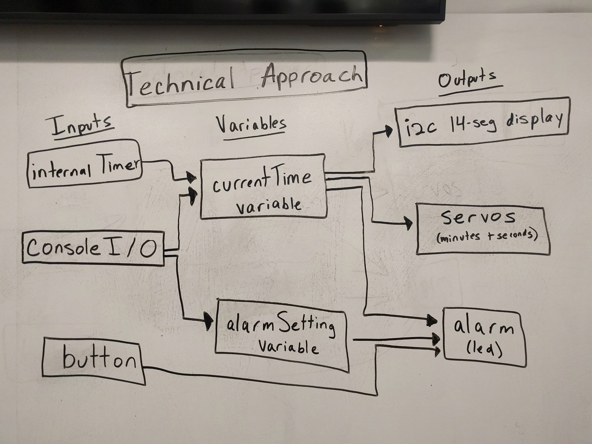

# Retro Alarm Clock
Authors: Kyle Martin, David Kirk, Ayush Upneja

2019-09-20

## Summary

In this skill quest, we connected the i2c alphanumeric display board and two servo motors to the ESP32 to create a retro alarm clock.  The alphanumeric board reads hours and minutes in military time, while the two servo motors display minutes and seconds.  Users can set both the current time and the alarm time through the command line.  For the alarm, we use four LEDs that light up when the current time is equal to the alarm time.  The lights can be turned off by button press.

## Evaluation Criteria

We successfully demonstrated:

- Two servos that indicate time in seconds and minutes
- An alphanumeric display that indicates time in hours and minutes
- The ability for a user to set the time
- The ability for a user to set an alarm

## Solution Design

Relevant pinouts for our design are as follows:

- Servo that reads seconds -> 12
- Servo that reads minutes -> 13
- I2C Alphanumeric Display -> SDA and SCL
- Button that stops alarm -> A2
- Alarm LEDs -> A6-A9

In our implementation, we ran six tasks in parallel: one task to run each servo, one task to handle internal timing, one task to write out to the alphanumeric display, one task to process the user input, and one task to operate the alarm.

User interaction with the system is done through the command line, and user inputs in the form of HH:MM are stored as strings.  These strings are parsed into two integers, one for hours and one for minutes.  These values are converted to seconds, added together, and stored as an integer number of "seconds since midnight".  Our system stores two such integer values, one for the alarm time and one for the current time.  Our system uses the ESP32 internal timer to increment the current time variable.  To display the time on the board, the current time is converted back into a string of HH:MM format and written to the board.  When the current time variable is equal to the alarm setting variable, pins A6-A9 are set to high and the LEDs are turned on.  Pins A6-A9 remain at a high setting until the GPIO button is pressed. 

Both servos use a minimum pulsewidth of 450 microseconds and a maximum pulsewidth of 2450 microseconds.  The seconds servo moves 3 degrees per second, completing its full 180 degree range in 60 seconds.  The minutes servo moves 3 degrees per minute, completing its full 180 degree range in one hour.  

## Investigative Question

To synchronize multiple ESP clocks with each other, we would have to connect the devices over a wifi network and create a virtual LAN network between them.  ESP32 devices can be connected by their hostnames and ping each other at a definable rate such that a change in one device would cause a change in the other device.    

## Sketches and Photos

## Supporting Artifacts
- [Link to repo]()
- [Link to video demo]()

## References

-----

## Reminders

- Video recording in landscape not to exceed 90s
- Each team member appears in video
- Make sure video permission is set accessible to the instructors
- Repo is private
