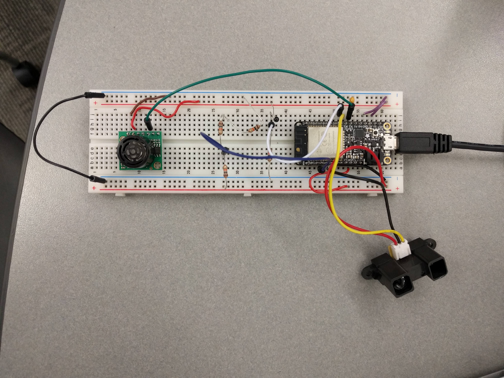
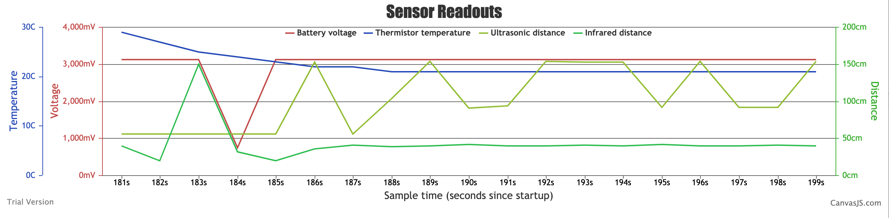

# Quest 2: Sensors
Authors: Kyle Martin, David Kirk, Ayush Upneja

2019-10-07

## Summary
In this quest, we wired four different devices to the ESP32: a thermistor, a battery, an ultrasonic sensor, and an IR rangefinder.  The ESP32 read the voltage of each device through four separate analog-to-digital converter (ADC) channels.  We converted voltage readings to engineering units, wrote the readings to the serial port at a rate of of 1Hz, and continuously aggregated the readings into a CSV file.  With each request to our "localhost/data" endpoint, we converted the most recent readings in the CSV file to a JSON object and sent it the front end for plotting.  The plot displayed the 20 most recent readings, updating at a rate of 1Hz.  

## Evaluation Criteria
In this quest, we successfully demonstrated:

- Periodic reporting of ultrasonic range in centimeters
- Periodic reporting of IR range in centimeters
- Periodic reporting of temperature in C
- Graphing of sensor data on localhost 

## Solution Design

### Wiring
We wired the battery reader with a 2/3 voltage divider from USB input (5V) and the thermistor in series with a 10k resistor. We connected the ultrasonic and infrared rangefinders directly with 5V and 3.3V power and ground respectively, feeding their analog outputs directly into the ESP32's ADC pins.  We used the following GPIO pins for each sensor:

- Battery reader -> GPIO32 (ADC_CHANNEL_4)
- Thermistor -> GPIO36 (ADC_CHANNEL_0)
- Ultrasonic sensor -> GPIO34 (ADC_CHANNEL_6)
- IR rangefinder -> GPIO39 (ADC_CHANNEL_3)

### Microcontroller Code
In the microcontroller code, we defined five functions: one per sensor to read and convert voltage readings and one to call the sensor functions and print the most recent readings to the serial port.  

In the "battery" function, we simply returned the raw voltage in mV.  

In the "thermistor" function, solved for the thermistor resistance using the voltage divider formula: Vout = Vin*[R2/(R2+R1)], where R2 is unknown, Vout is the current voltage reading, Vin is 3.3 volts, and R1 is 10kohm.  From here, we solved for the temperature using the formula: temperature = -(1 / ((ln(R0/R2)/B) - (1/T0))), where R0 = 10kohm, R2 is the current resistance across the thermistor, T0 is 298K, and B = 3435.  Then, we simply converted Kelvin to Celsius and returned the reading.  

In the "ultrasonic" function, we converted the voltage reading to distance in cm using the formula: distance = (voltage/6.4) * 25.4 / 10.  We then returned the reading.  

In the "rangefinder" function, we converted the voltage reading to distance in cm using the formula: distance = (-0.06 * voltage) + 125.24.  We capped the value between 20 and 150 centimeters because the rangefinder is not functional outside of this range.  We then returned the reading.

In the "display_console" function, we ran the four sensor functions above and printed the values to the serial port in CSV format.  Then, we added a task delay of one second.

In the main function, we initialized four ADC channels (one per sensor) and initialized a task for the "display_console" function.  Therefore, the the sensor readings are printed in a syncronous manner because they are all obtained within the "display_console" function.

### Node.js and Canvas.js
We used a Node.js web app with Express.js for REST calls and Canvas.js on the front end for graphing. The program reads the serial output of the ESP32 using the serialport module, and then saves each line to a csv file created at startup. It also sets up three REST endpoints, "/" for sending webpage HTML, "/data" for converting and sending all saved sensor data in JSON format, and "/serialline" for converting and sending the most recent serial reading in JSON format. 

When the user loads the webpage for the first time, it reads from this file to generate the chart through the /data REST endpoint. After that, it polls every 100ms for new data from /serialline, and adds that data to the chart if it is new. By deleting the oldest data point from the chart every time we add a data point, we created a ticker tape-like scrolling effect, allowing the chart to update in real time.

## Investigative Question
*How fast can you sample each sensor and at what resolution based on the data sheet specs for each item?*

## Sketches and Photos

*Our wiring scheme*

*Example screenshot of the chart*

## Supporting Artifacts
- Repo Link:https://github.com/BU-EC444/Team2-Upneja-Martin-Kirk/tree/master/quest-2
- Video Link: https://www.youtube.com/watch?v=4KVZYAVvwL4&feature=youtu.be&fbclid=IwAR3loRq81-l9K01kI0XC7e0eM-dYWTdFfpwOzJDskPekX4ygM9tRI3Vg89U

## References
- esp-idf/examples/peripherals/adc
- https://canvasjs.com/javascript-charts/
- https://expressjs.com/
- https://www.npmjs.com/package/csvtojson
- https://www.npmjs.com/package/serialport

-----

## Reminders

- Video recording in landscape not to exceed 90s
- Each team member appears in video
- Make sure video permission is set accessible to the instructors
- Repo is private
