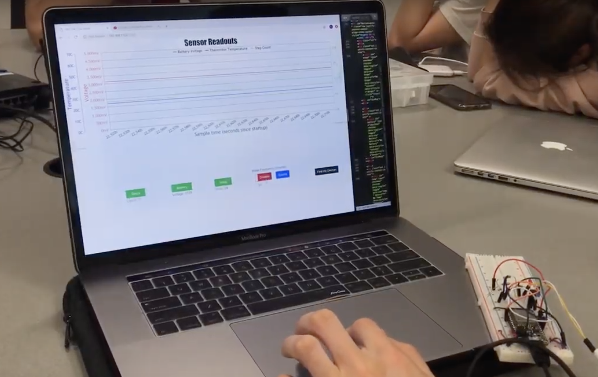

# Quest 3
Authors: Ayush Upneja, David Kirk, Kyle Martin
2019-10-24
## Summary

In this quest, we built a wearable that tracks biometric data and communicates information to a central graphical hub.  We wired three different devices to the ESP32: a battery, a thermistor, and a vibration sensor.  We also wired two LEDs to the ESP32, where one blinked if pinged by the user from the front-end and another blinked to notify the user to drink water.  The battery level, temperature, and step count were sent to the node server through a UDP socket and then sent to the front-end through a TCP socket.  To control the device from the front-end, we used HTTP post requests, which carried payload information that was sent back to the ESP32 through the UDP socket.  In the front end we plotted real-time sensor data using Canvas.js and embedded buttons, switches, and text fields to control the post requests.  We also port forwarded our application so that the device could be monitored and controlled from any IP.

The division of labor was as follows:
- David wired the device and wrote the embedded C code to interface with it.
- Kyle wrote the node.js server and set up port-forwarding.
- Ayush wrote the front-end HTML file that plotted sensor data and interfaced with the user.

## Evaluation Criteria

In this quest, we successfully demonstrated:

- Sending data across a separate IP network to control a remote device through web client
- Recieving data across a  separate IP network from remote sensors into web client
- Scheduling alerts via web client
- Triggering immediate alerts
- Displaying real-time biometrics

## Solution Design

### Front-end

In our HTML file, we embedded bootstrap 5 toggle buttons to turn sensor readings on or off. The on-toggle command is evaluated through jquery functions to take away the necessity of a submit button. The water alarm button cannot be set to a value other than a positive number and provides an alert when a number less than or equal to zero is entered.  We also embedded a "find my device" button that lights up the red LED when pressed.

Sensor data is read from the TCP Socket and is graphed into Canvas.js every 1/10 of a second. Turning sensor readings off hides the relevant line in the graph and sends a HTTP post request to the node.js server that carries a JSON payload.  The JSON payload is as follows:

{
"state": 0
}

If sensor readings are turned back on, the state key is set to 1 in the JSON payload.  All post requests coming from the frontend carry a payload of this form, with the ony exception being the request that updates the water interval.  In this request, the state key could be set to any positive integer number of seconds.

### Back-end

Our node.js server handled HTTP post requests, sent sensor data to the front-end through TCP sockets, and received sensor data from the ESP32 through UDP sockets.  In the node file, called server.js, we defined a global state variable that initializes to "111101800".  The first four bits correspond to on/off switches for the vibration sensor, thermistor, battery monitor, and water alarm, respectively.  The 5th bit correponds to the device pinger.  The rest of the string is an integer number of seconds corresponding to how often the water alarm will go off.  

In each of the six post requests, we index the JSON payload to obtain the updated state.  Then, we convert the number to a string and update the global state variable.  For example, if the vibration switch is turned off, the new state will be "011101800".  In each post request, the updated state is sent to the ESP32 through the UDP socket.

The server was hosted on port 3000, and the UDP socket was connected through port 3333.  We port-forwarded port 3000 to port 2222 using DDNS.  To do so, we obtained a domain from No-IP.com.  Our domain name was ec444group2.hopto.org:2222.  

### Embedded

The ESP32 reads three different sensors (battery voltage, thermistor, and vibration sensor), and outputs to two LEDs. The firmware running on the ESP32 runs three parallel tasks: a UDP socket receiver, an output handler, and a timer handler. Additionally, there is a GPIO interrupt for reading, debouncing, and counting steps detected by the vibration sensor.

The socket receiver, udp_client_receive(), waits for a response from the target server (determined by the HOST_IP_ADDR and PORT macros). On receiving one, it parses and acts on the result. The first 5 characters of the response always form a binary string, with each bit corresponding to a feature. From left to right, they enable the vibration sensor, the thermistor, the battery reader, the "drink water" alarm, and the "find my device" LED. Any digits after that are interpreted as a new interval for the "drink water" alarm.

The output task, output_task(), reads from the thermistor and battery every 0.1 seconds, and formats a JSON object from those two readings and the global step counter. It then sends the resulting string through the UDP socket to the server.

The timer task, timer_evt_task(), flashes the blue LED on and off for five seconds when triggered. This trigger happens according to an interval set by UDP input.

The interrupt task, vibration_interrupt_task(), waits for a GPIO trigger from the vibration sensor. When it detects one, it attempts to count 20 sensor bounces in the next 50ms. If this happens, it increments the global steps counter.

### Wiring 

## Sketches and Photos

## Supporting Artifacts
- Repo Link: https://github.com/BU-EC444/Team2-Upneja-Martin-Kirk/tree/master/quest-3
- Demo Video: https://youtu.be/Iqs3mKGPSEw

## References

- http://whizzer.bu.edu/briefs/design-patterns/dp-socketIO
- https://github.com/BU-EC444/code-examples/tree/master/node-socketio
- https://canvasjs.com/html5-javascript-dynamic-chart/
-----
