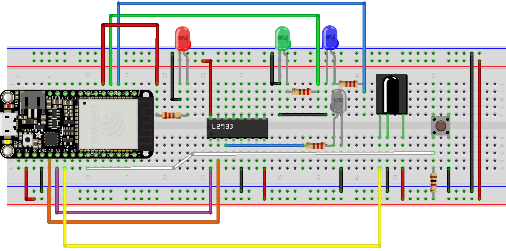
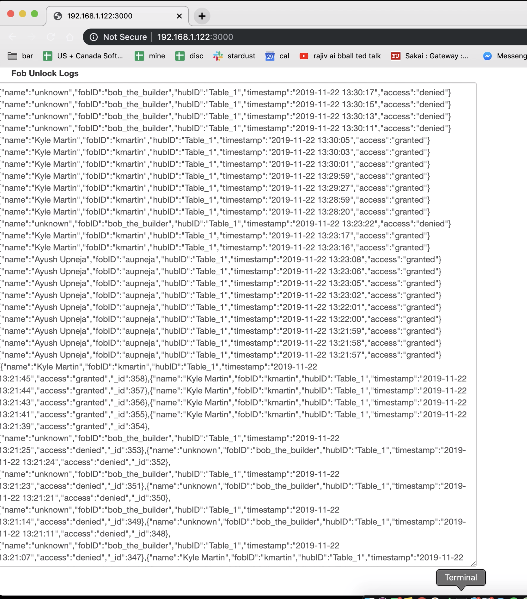
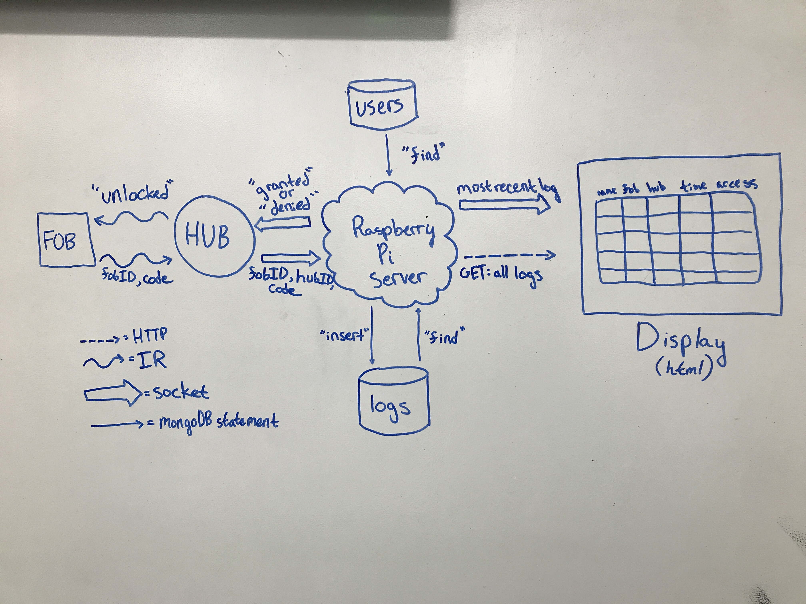
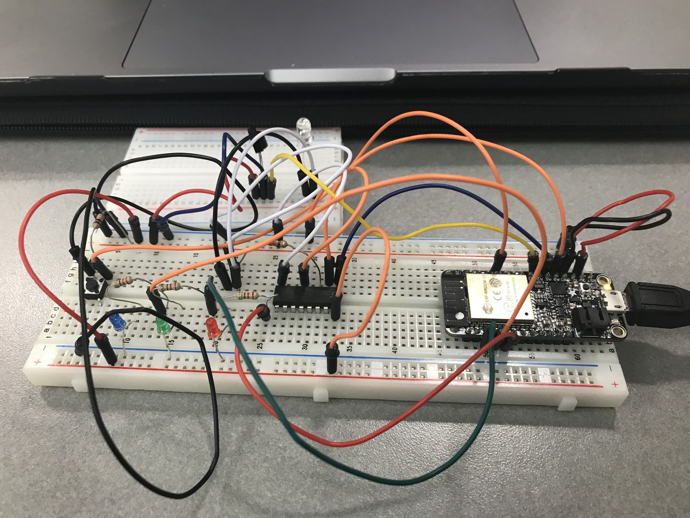

# Quest 5
Authors: Kyle Martin, Ayush Upneja, David Kirk

2019-11-22

## Summary
In this quest, we developed a security hub that recieves key access requests through IR communication.  These requests are sent to server and are either approved or denied based off of information in the users database.  All requests to the server are logged.

## Evaluation Criteria

- Fob relays {fob_ID,code} to security hub, hub sends {fob_ID,hub_ID,code} to server; server responds to fob, fob green light turns on.
- Logs fob accesses to database {fob_ID,hub_ID,person,time,location}
- Database is on RPi
- Web-based management interface shows real-time active unlocked fobs and history of unlocked fobs (with actual time of unlock).
- Uses at least 3 fobs with unique IDs

## Solution Design

For explanation purposes, anything in brackets is a placeholder for real data.

### Circuit/Hardware


We used the same circuit as described in the IR RX/TX skill for both the fob and the hub. We changed a few of the pin assignments for convenience, but otherwise the circuits are identical. In it, the ESP32 generates a 38kHz signal and a UART signal, which are combined using an H-bridge and transmitted through an IR LED. The IR receiver is connected directly to a GPIO input. The button is wired with a 10kΩ pull-up resistor and is also connected to a GPIO input. The 3 colored LEDs are connected to GPIO outputs through 220Ω current-limiting resistors.

For the server, we are using the provided Raspberry Pi Zero.

### Firmware

The fob and hub programs are both based on the IR RX/TX skill. They use the RMT library to generate a 38kHz signal and the UART library to generate and receive data signals through IR communications. 

#### Fob
The fob uses a GPIO interrupt to trigger a UART transmission of the following format when the button is pressed:

```
hub: [fob_id] [password]
```
Both of the above values are hardcoded. In a parallel task, the fob also listens for unlock signals of the following format:
```
unlock
```
If it receives an unlock message, it lights its green LED.

#### Hub

The hub listens for an incoming IR UART transmission beginning with the string "hub:". It also connects to wifi and sets up UDP communication using methods and libraries we've used in previous quests. Once it recognizes a valid IR message, it reformats this message into JSON of the following format, adding its own ID, and transmits it over UDP to the server:
```
{"fob_id": "[fob_id]", "hub_id": "[hub_id]", "code", "[code]"}
```
In a separate parallel task, the hub also listens for incoming UDP messages of the following formats:
```
granted
denied
```
If it receives "granted", it lights its green LED for a second and transmits "unlocked" over IR to the fob. If it receives anything else, including "denied", it lights its red LED for a second.

### Backend/Database

The backend is comprised of three components: a node.js file, a TingoDB database for users, and a TingoDB database for logs.  The users database held three preset entries, one for each fob that we used.  They are listed as follows.
```
{name: "Kyle Martin", fobID: "kmartin"}
{name: "Ayush Upneja", fobID: "aupneja"}
{name: "David Kirk", fobID: "dkirk"}
```
Requests from the security hub are sent to the server through a UDP socket.  Upon recieving these messages, the server queries the user database to check if the user exists.  If so, the server then compares the code sent through the UDP message with the password stored in the server.  If these two codes match then the string "granted" is sent back through the socket.  The key access log is then formed, inserted into the database, and sent to the frontend using a TCP socket.  An example of a successful log is shown below.
```
{name: "Kyle Martin", fobID: "kmartin", hubID: "Table_1", Timestamp: "11/22/19 12:20:19", access: "granted"}
```
If the fob ID query fails or if the codes do not match, the server sends the string "denied".  The log is formed, inserted into the logs database, and sent to frontend using TCP.  An example of an unsuccessful log is shown below.
```
{name: "unknown", fobID: "bob_the_builder", hubID: "Table_1", Timestamp: "11/22/19 12:20:19", access: "denied"}
```
The server also implements an HTTP GET request that can be used to obtain all logs in the database.

### Frontend

In the front-end we pull the 30 most recent database entries and reverse the order of them so that the most recent entries are at the top. The data comes in a string format which is JSON parsed to display individual lines better. Here through a socket, every time a new datapoint is registered in the database, it is added to the top of the textarea so that the most recent unlocks are clearly displayed. Here is a picture of our frontend to display exactly how this looks.



### Investigative Question

Comment on the security of your system. How would you best hack into this system if you were so inclined? How could you prevent this attack? Describe the steps.

This system is incredibly insecure. You could hack into this system by:

- Inserting an IR receiver next to a fob and reading the id and password coming from it, and then flashing a new fob with those same credentials and using it
- Listening to network traffic with a tool like Wireshark to retrieve the same information
- Sending the string "granted" over UDP directly to the hub
- Guessing password with common dictionary words and using one of the usernames visible from the database contents on the web page
- Logging directly into the Pi using the default username and password and reading the database and server code as admin to obtain credentials
- Stealing the SD card on the Pi and reading it directly with another computer to obtain credentials


To prevent attacks, we could implement the following strategies:

- One way we could prevent this attack is by creating our own hashing algorithm and storing userIDs only in their hashed form. Thus it is decrypted by the hub and no one could gain access to the decrypted version unless they gained access to the hashing function.

- Another way to prevent this type of attack is to use a hopping or rolling code. Both the fob and the hub would use the same random number generator (RNG). When the fob sends a code, it uses the RNG to pick a new code which is stored in memory. Then when the hub receives a valid code, it uses the same RNG to generate a new one. Thus they are completely in sync and it would be very difficult for someone to mimic the random number generator.

## Sketches and Photos




## Supporting Artifacts

- [Link to repo]()
- [Link to video demo](https://www.youtube.com/watch?v=KUql92ul6p4)

## References

-----

## Reminders

- Video recording in landscape not to exceed 90s
- Each team member appears in video
- Make sure video permission is set accessible to the instructors
- Repo is private
